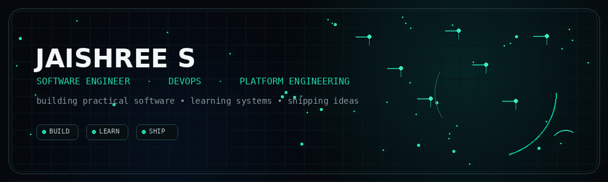
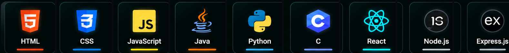
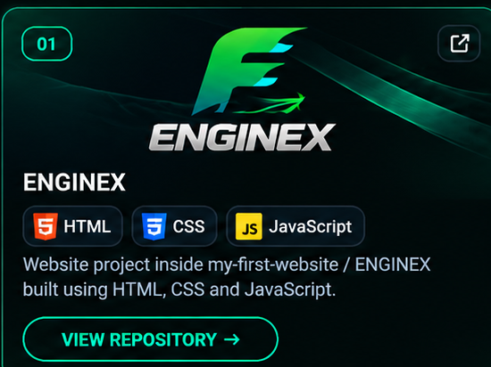
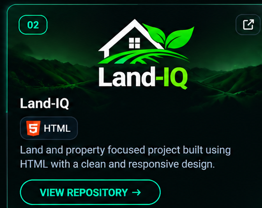
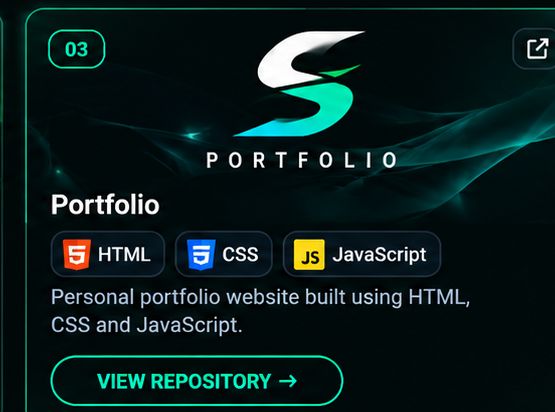

### 2nd-Year B.E. Computer Science & Engineering Student

**Software Engineering · DevOps · Platform Engineering · Front-end · Back-end · Prompt Engineering**

## About

CSE student focused on building practical software, understanding reliable systems, and turning ideas into working products.

**Currently exploring:** Software Engineering · DevOps · Platform Engineering · AI workflows

## Tech Stack

## Projects

&nbsp;

&nbsp;

## GitHub Activity

 

<a href="https://github.com/Shree2831">
<strong>View full GitHub activity →</strong>
</a>

